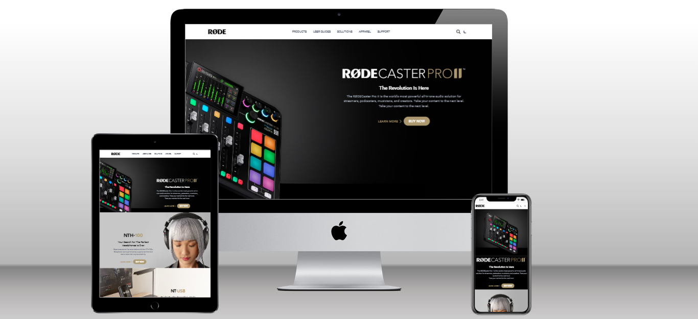

# Rode Dot Com Clone

## Who am I?
Hi, I'm `Vikas Rohra`, a web developer living in Mumbai, India.

  

## About this project
 - This project is basically a landing web page of Paytm developed with HTML, CSS and Tailwind CSS.
 - It took me around `8 hrs` to complete this project.
 - Fully Responsive
 - Dark and Light Mode Toggler
 
  

## Below are the take aways from this project
 - Usage of Tailwind CSS to build beautiful looking websites
 - Create responsive websites using Tailwind CSS
 - To unable and disable Dark and Light mode  

  

## Preview

## Live link
 [Rode Clone](https://rode-dot-com.netlify.app/)
 
 [Portfolio](https://vikasrohra.com)
